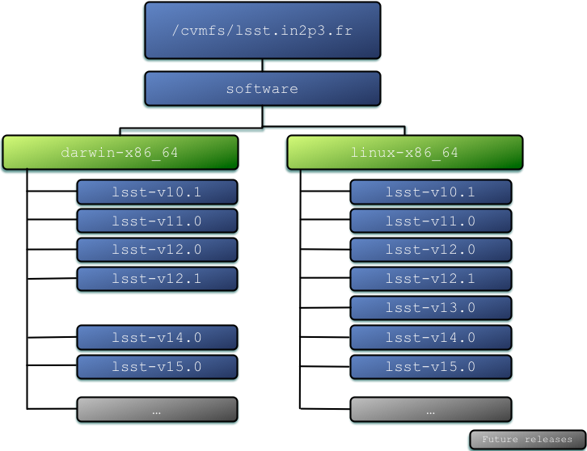

# Distribution of LSST software via CernVM-FS

## Table of contents

* [Introduction](#introduction)
* [Benefits](#benefits)
* [Installation](#installation)
* [Configuration](#configuration)
* [Usage](#usage)
* [Available releases](#available-releases)
* [Advanced Usage](#advanced-usage)
* [Troubleshooting](#troubleshooting)
* [Frequently Asked Questions](#frequently-asked-questions)
* [Credits](#credits)


## Introduction
This document provides the steb-by-step instructions to configure your computer to use the binary distribution of the [LSST science pipelines](https://pipelines.lsst.io) using [CernVM-FS](http://cernvm.cern.ch/portal/filesystem).

CERN's CernVM-FS is a software component which allows you to mount a remote software repository in **read-only mode**. It will appear to your computer as if the software were locally installed. At [CC-IN2P3](http://cc.in2p3.fr) we prepared a binary distribution of the LSST stack to be used through CernVM-FS. You will find below the procedure for installing CernVM-FS and configuring it to use the binary LSST software repository.

Context and perspectives about this work can be found in [this presentation](https://speakerdeck.com/airnandez/experimenting-with-cernvm-fs-for-distributing-lsst-software).

**WARNING** : *please bear in mind that this work is experimental. Your feedback on how to improve it is very welcome. Scroll to the end of this document to know how you can provide feedback.*

## Benefits
With this method, you need to install and configure CernVM-FS only once. Once this is done, when your computer is connected to the network, you will find the available versions of the LSST software stack under the local directory:

	/cvmfs/lsst.in2p3.fr

This method of distributing the software is particularly useful for individuals: you don't need to build and install each official LSST software release from sources on your personal computer. You rather mount and use the binary distribution prepared for your convenience.

The figure below shows the namespace and the releases currently available:



Please note that you don't need special privileges to use the LSST software stack distributed this way: any user on a pre-configured computer can use the software. However, in order to install and configure CernVM-FS, a one-time process, you need super-user privileges on the target machine.

## Installation
We have succesfully tested several versions of the LSST software using this installation on MacOS X 10.10 Yosemite, Scientific Linux 6, Scientific Linux 7, CentOS 7 and Ubuntu 14.04. It may work on other Linux distributions as well.

### Installing on Scientific Linux 6 and 7, CentOS 7 (64 bits)
To download the software from CERN's repository and install it do:

   	$ cd /tmp
	$ curl -O https://ecsft.cern.ch/dist/cvmfs/cvmfs-2.1.20/cvmfs-2.1.20-1.el6.x86_64.rpm
	$ curl -O https://ecsft.cern.ch/dist/cvmfs/cvmfs-config/cvmfs-config-default-1.2-2.noarch.rpm
	$ sudo yum install --assumeyes ./cvmfs-*.rpm

### Installing on Ubuntu 14.04 (64 bits)
Some packages are either necessary or recommended on Ubuntu. To install them do:

    $ sudo apt-get install autofs attr gdb git sysv-rc-conf uuid libossp-uuid16

Download and install CernVM-FS:

    $ cd /tmp
    $ curl -O https://ecsft.cern.ch/dist/cvmfs/cvmfs-2.1.20/cvmfs_2.1.20_amd64.deb
    $ curl -O https://ecsft.cern.ch/dist/cvmfs/cvmfs-config/cvmfs-config-default_1.1-1_all.deb
    $ sudo dpkg -i ./cvmfs_2.1.20_amd64.deb  ./cvmfs-config-default_1.1-1_all.deb
    
*NOTE: this method has been reported to work also on Linux Mint v17.3*

### Installing on OS X 10.9 Mavericks, 10.10 Yosemite, 10.11 El Capitan
* Download and install the **latest stable** release of [FUSE for OS X](https://osxfuse.github.io/). This is a dependency of the CernVM-FS client.

* Download and install [the CernVM-FS client package](https://ecsft.cern.ch/dist/cvmfs/cvmfs-2.1.20/cvmfs-2.1.20.pkg). Alternatively, you can do it manually if you prefer:

	```
   	$ cd /tmp
	$ curl -O https://ecsft.cern.ch/dist/cvmfs/cvmfs-2.1.20/cvmfs-2.1.20.pkg
	$ open cvmfs-2.1.20.pkg
	```

At this point, you have installed the CernVM-FS client software on your computer. For configuring it please see the next section.


## Configuration
Configuring the CernVM-FS client to use the binary distribution of LSST software served by CC-IN2P3 is a *one-time operation*:

* Clone this repository and run the provided configuration script. The configuration script needs super-user privileges:

		$ cd /tmp
		$ git clone https://github.com/airnandez/lsst-cvmfs.git
		$ cd lsst-cvmfs
		$ sudo bash ./configure.sh

	After this step, among other things, an unprivileged user `cvmfs` is created in your computer and several configuration files with sensible default values are located under `/etc/cvmfs`.

  You can tell the configuration process was successful if you don't see any error message.

* **[OS X only]** On OS X, you need to manually mount the file system:

		$ sudo mount -t cvmfs lsst.in2p3.fr /cvmfs/lsst.in2p3.fr

	For unmounting do:

		$ sudo umount /cvmfs/lsst.in2p3.fr

* **[Linux - recommended]** On Linux, the CernVM-FS client uses `autofs` for automatically mounting and unmounting the file system. We recommend to configure the `autofs` service to start at boot time. On Scientific Linux and CentOS do:

		$ sudo chkconfig autofs on

	and on Ubuntu, do:

		$ sudo sysv-rc-conf autofs on


Now you are ready to use the stack. See next section.

## Usage
Once the software is installed and configured in your computer, a one-time process, you don't need super-user privileges to use the LSST software.

In order to use the LSST science pipelines, you need first to bootstrap your environment for a specific version of the LSST software for which a binary distribution is available. For instance, to use LSST `v12.1` on a Linux computer do:

		$ cd /cvmfs/lsst.in2p3.fr/software/linux-x86_64/lsst-v12.1
		$ source loadLSST.bash

Now you are ready to test your installation by [downloading and running the demo project](https://pipelines.lsst.io/install/demo.html#download-the-demo-project).  

**NOTE**: *there are some known issues with some releases of the LSST software distributed via this channel, which may not work on all Linux distributions. See the [known issues](https://github.com/airnandez/lsst-cvmfs/issues) if you experience some problems and don't hesitate to provide feedback.*

## Available releases
At any moment, you can see what releases are available for Linux-based machines by inspecting the directory:

	ls -l /cvmfs/lsst.in2p3.fr/software/linux-x86_64

You can list the releases available for OS X with the command:

	ls -l /cvmfs/lsst.in2p3.fr/software/darwin-x86_64

Currently you will find the releases presented in the table below:

| Platform                | Available versions of LSST software |
| ---------------------   | ----------------------------------- |
| Linux, x86_64, 64bits   |   `v10.1`, `v11.0`, `v12.0`, `v12.1` |
| Darwin, x86_64, 64bits  |   `v10.1`, `v11.0`, `v12.0`, `v12.1` |

For details on the platform each binary release was built on please refer to the `README` file in the corresponding directory.

## Advanced usage
Details on how to use this distribution mechanism for more advanced use cases are provided in the [Advanced Usage](AdvancedUsage.md) document. There you will find details on how you can develop your own software package which depends on other packages already present in the binary distribution.


## Troubleshooting
Please note that in order for this distribution mechanism to work for you, you need your machine to be connected to the network and able to contact CC-IN2P3 server. To check this is the case please do:

	$ curl --proxy http://cccvmfssqdli01.in2p3.fr:3128 --head http://cccrnvmfs01.in2p3.fr/cvmfs/lsst.in2p3.fr/.cvmfspublished

You should see a line containning `HTTP/1.0 200 OK` which indicates that your machine can talk to the relevant server.

Please also refer to the [known issues](https://github.com/airnandez/lsst-cvmfs/issues).

## Frequently Asked Questions

* **How can I provide feedback?**

  Your feedback is very welcome. Please feel free to [open an issue](https://github.com/airnandez/lsst-cvmfs/issues).

*  **Where can I get more detailed information on CernVM-FS?**

	The [CernVM-FS downloads page](http://cernvm.cern.ch/portal/filesystem/downloads) contains additional information. In addition, you may want to read the [CernVM-FS Technical Information](http://cernvm.cern.ch/portal/filesystem/techinformation) for more in-depth information on how CernVM-FS works.

* **Can I use my remote LSST software distribution while disconnected from the network?**

  The CernVM-FS client caches all the file metadata and the contents of the accessed remote files in the local disk of your computer. If you have previously used the stack it is likely that the relevant files are locally available in your local disk, in which case, you may work while disconnected. However, we have not tested this thoroughly, so let us know how it works for you.

* **Can I use this for my Docker containers?**

  Yes, you can configure your container for automatically mounting a read-only file system with LSST software stack ready to use. Sébastien Binet did exactly this, so you can just use as is or as a baseline for your own containers. You will find all the details [here](https://github.com/hepsw/docks/tree/master/cvmfs-lsst).

## Credits
This work was done by Fabio Hernandez from [IN2P3/CNRS computing center](http://cc.inp3.fr) (Lyon, France) with very valuable help from Vanessa Hamar who set up the CernVM-FS server and proxy infrastructure.
